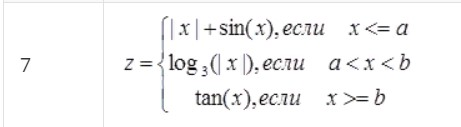
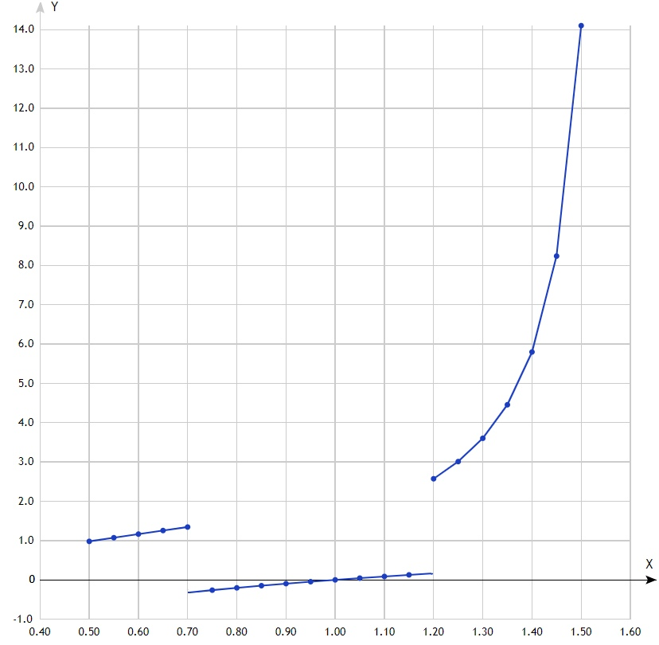

МИНИСТЕРСТВО НАУКИ  И ВЫСШЕГО ОБРАЗОВАНИЯ РОССИЙСКОЙ ФЕДЕРАЦИИ  
Федеральное государственное автономное образовательное учреждение высшего образования  
"КРЫМСКИЙ ФЕДЕРАЛЬНЫЙ УНИВЕРСИТЕТ им. В. И. ВЕРНАДСКОГО"  
ФИЗИКО-ТЕХНИЧЕСКИЙ ИНСТИТУТ  
Кафедра компьютерной инженерии и моделирования
<br/><br/>

### Отчёт по лабораторной работе №2<br/> по дисциплине "Программирование"
<br/>

студента 1 курса группы ПИ-б-о-191(1)  
Корзина Василия Алексеевича
направления подготовки 09.03.04 "Программная инженерия"  
<br/>

<table>
<tr><td>Научный руководитель<br/> старший преподаватель кафедры<br/> компьютерной инженерии и моделирования</td>
<td>(оценка)</td>
<td>Чабанов В.В.</td>
</tr>
</table>
<br/><br/>

Симферополь, 2019

## Лабораторная работа №2
Табулирование кусочно-заданной функции\
\
**Цель:** 
1. Овладеть практическими навыками разработки и программирования вычислительного процесса циклической структуры.
2. Сформировать навыков программирования алгоритмов разветвляющейся структуры.
3. Изучить операторы ветвления. Особенности использования полной и сокращенной формы оператора **if** и тернарного оператора.
\
**Ход работы:**\
**1\.** Напишите на языке С++ программу которая для функции **f(x)** на интервале **x ∈ [Xнач; Xкон]**:
* выводит в консоль значения функции **f(x)** с шагом **dx**;
* определяет максимальное и минимальное значение функции.\
Вариант 5.\


```C++
#include "stdafx.h"
#include <iostream> 
#include <math.h>  

using namespace std;


int main()
{
	setlocale(LC_ALL, "Rus");
	double F, x, Fmax, Fmin, xBegin, xEnd, dx, a, b;
	bool i = 0;
	cout << "Введите A: ";
	cin >> a;
	cout << "Введите B: ";
	cin >> b;
	cout << "Введите Xнач.: ";
	cin >> xBegin;
	cout << "Введите Xкон.: ";
	cin >> xEnd;
	cout << "Введите dx: ";
	cin >> dx;


	for (x = xBegin; x <= (xEnd + dx / 2); x += dx)
	{
		if (x - (a + dx / 2) <= 0.000001)
		{
			F = abs(x) + sin(x);
		}

		else if (((a + dx / 2) - x < 0.000001) && (x - (b - dx / 2) < 0.000001))
		{
			F = log(abs(x)) / log(3);
		}

		else if (x - (b - dx / 2) >= 0.000001)
		{
			F = tan(x);
		}

		if (i == 0)
		{
			Fmax = F;
			Fmin = F;
			i = 1;
		}

		if (F > Fmax)
		{
			Fmax = F;
		}

		if (F < Fmin)
		{
			Fmin = F;
		}

		if (abs(F) < 0.0000001)
		{
			F = 0;
		}

		cout << "F(" << x << ")=" << F <<"\n";
	}

	cout << "\nFmin=" << Fmin << "\nFmax=" << Fmax;

}

```
\
**2\.** Протабулируйте функцию и запишите получившиеся реультаты в отчёт в виде таблицы.
При этом **A** = 0.7, **B** = 1.2, начала и конца интервала **Xнач** = 0.5, **Xкон** = 1.5 и шага **dx** = 0.05.\
**3\.** Определите минимальное и максимальное значение функции на указанном интервале.\
**Fmin**=-0.26186  **Fmax**=14.1014\
**4\.** Постройте график функции. Добавьте на график точки, которые у вас получились в процессе табуляции.
Добавьте на график точки минимума и максимума с метками значений.\
\
*рис.1: График функции*\
\
\
*рис.2: Таблица точек*\
\
**Вывод:** в ходе выполнения данной лабораторной работы я овладела практическими навыками разработки и программирования вычислительного процесса циклической структуры,
свормировала навыки программирования алгоритмов разветвляющейся структуры и изучила оператор ветвления **if** на языке C++.


